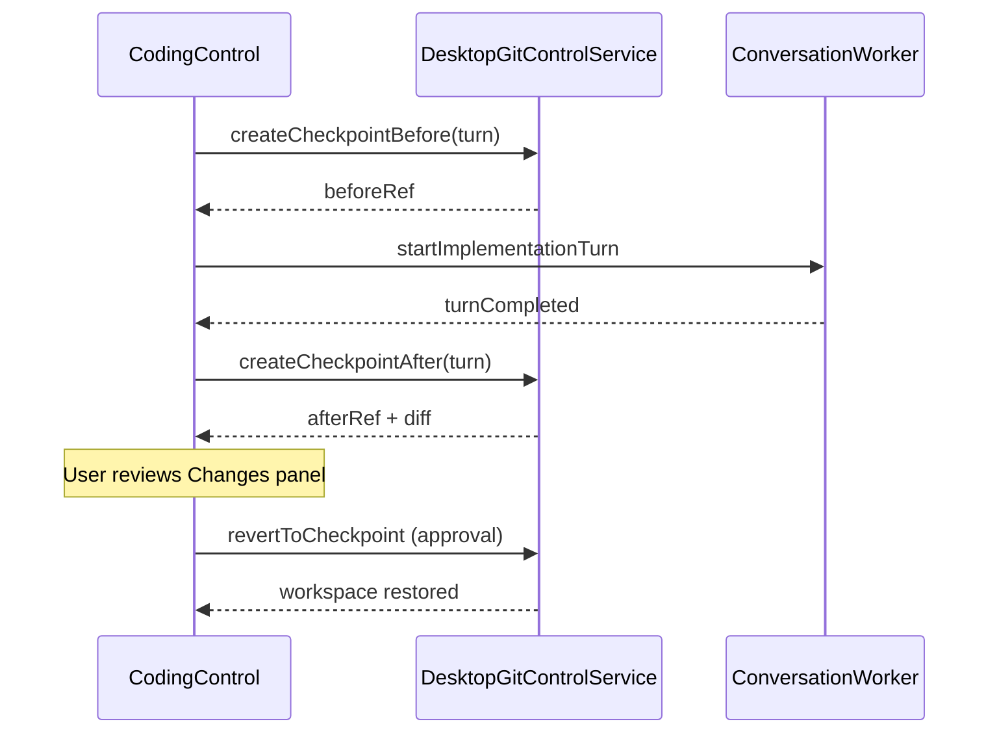

# Per-turn git checkpoints — design

Status: proposed · 2026-08-27

## Problem

Kaname's worktree lifecycle (proposed → ready → dirty → review → accepted) is strong for **final acceptance** but weak for **mid-iteration rollback**. T3 brackets each turn with hidden git refs and exposes `thread.checkpoint.revert` ([orchestration.ts](https://github.com/pingdotgg/t3code/blob/main/packages/contracts/src/orchestration.ts)).

Without checkpoints, a bad implementation turn forces manual git reset or worktree abandonment.

## Goals

- Hidden ref before and after each `codingImplementation` turn in an isolated worktree.
- Turn-scoped diff surfaced in the **Changes** panel.
- Approval-gated revert restores workspace files; optional provider conversation realignment when the driver supports it.
- Preserve existing signed-commit + Mori evidence path for acceptance.

## Non-goals

- Replacing Kaname's approval-gated worktree creation.
- Automatic revert without user action.
- Checkpointing during read-only plan turns.

## Ref naming

```
refs/kaname/checkpoints/<thread-id>/<turn-id>/before
refs/kaname/checkpoints/<thread-id>/<turn-id>/after
```

Refs are not pushed; stored locally in the worktree's object database.

## Model extension

```swift
public struct DesktopCodingCheckpointRecord: Codable, Equatable, Identifiable, Sendable {
    public let id: String
    public var threadID: String
    public var worktreeID: String
    public var turnID: String
    public var beforeRef: String
    public var afterRef: String?
    public var diffSummary: String
    public var diffStat: String
    public var createdAtUnixMillis: Int64
}
```

## Flow



## Authority

- Creating checkpoints: automatic, no approval (read-only git plumbing).
- **Revert:** inbox approval with exact target `checkpoint:<id>`, consequence listing changed paths, reversible flag true.
- Revert blocked when worktree state is `accepted` or cleanup pending.

## Git operations

Implement in [`DesktopGitControlService.swift`](../Sources/KanameConnectivity/DesktopGitControlService.swift):

1. `git update-ref refs/kaname/checkpoints/... <HEAD>`
2. `git diff beforeRef afterRef --stat` for summary
3. Revert: `git read-tree` + checkout indexed paths, or `git reset --hard beforeRef` inside worktree only (never primary checkout)

## UI

- Changes panel: **Turn diff** section per checkpoint with revert button (disabled until approval granted).
- Evidence panel unchanged; acceptance still requires verification gates.

## Provider conversation

- Codex: store turn correlation ID; revert may require new thread or explicit resume boundary (document limitation in UI).
- Claude/OpenCode: best-effort; revert is workspace-first.

## Testing

- Fixture repo with linked worktree; two turns with file edits; revert restores first turn state.
- Approval fingerprint includes checkpoint ID + worktree revision.

## References

- T3 `CheckpointStore` / `VcsCheckpointOps`: https://github.com/pingdotgg/t3code/tree/main/apps/server/src/vcs
- Kaname worktree model: [`DesktopCodingControlModel.swift`](../Sources/KanameDesktop/DesktopCodingControlModel.swift)
